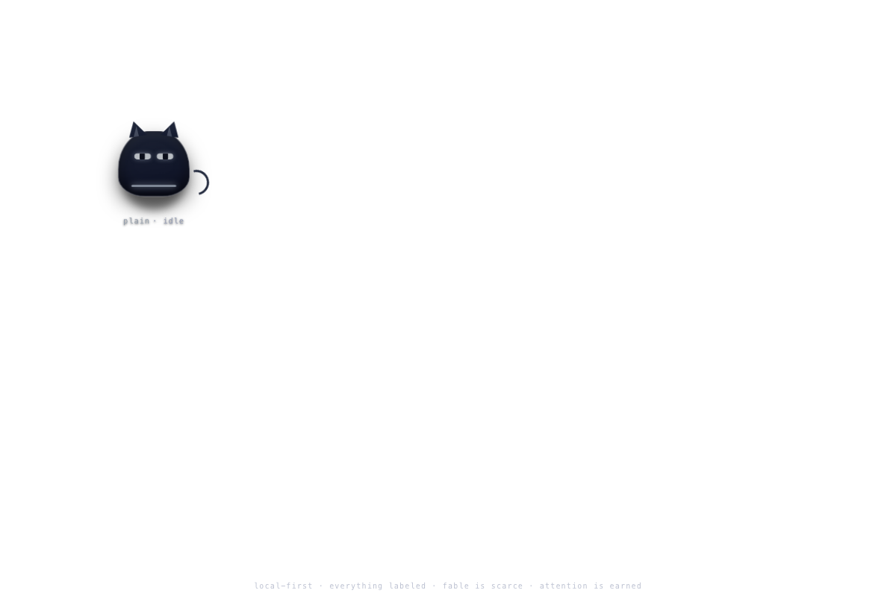
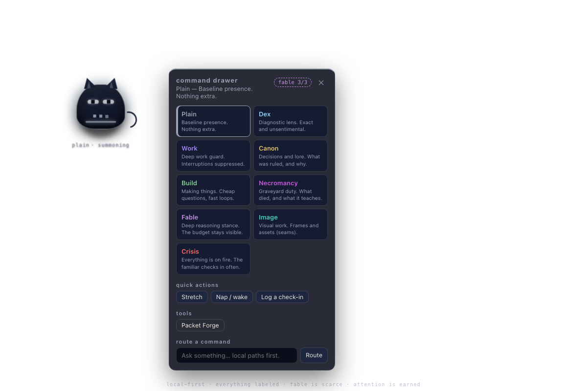
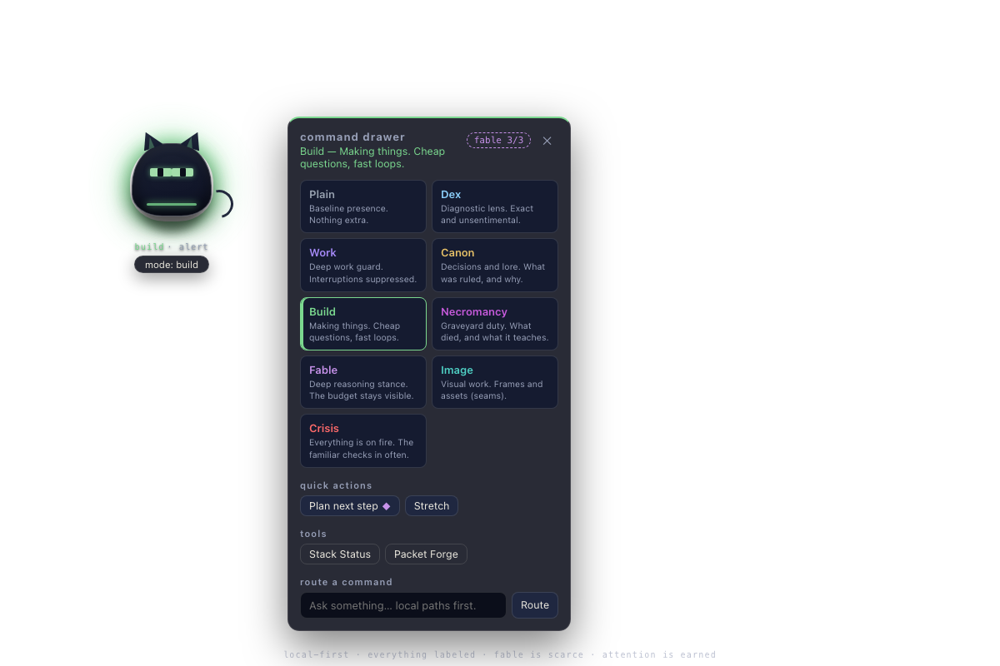
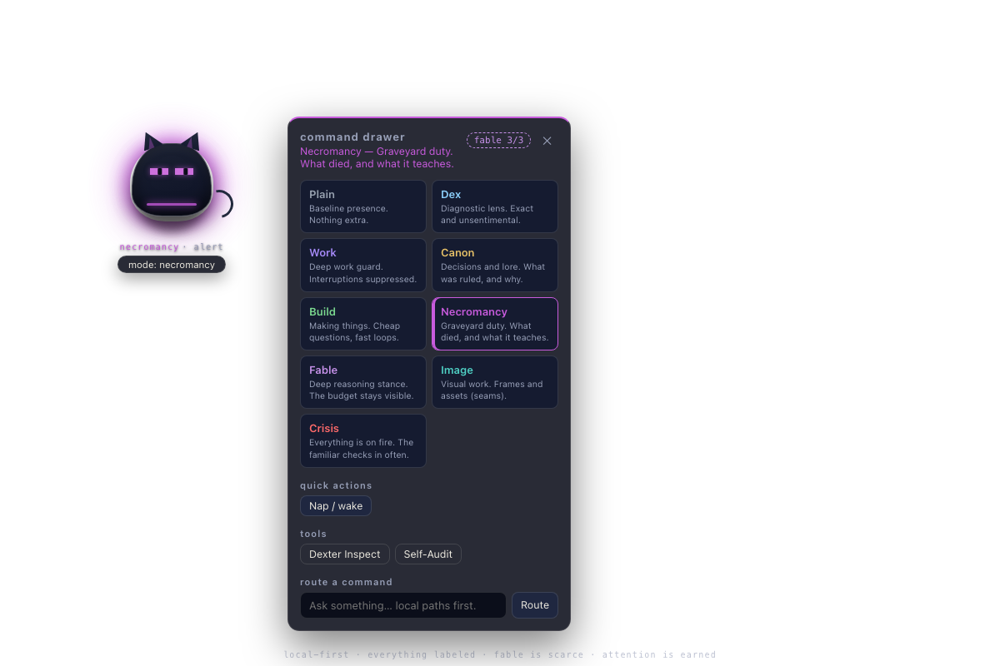
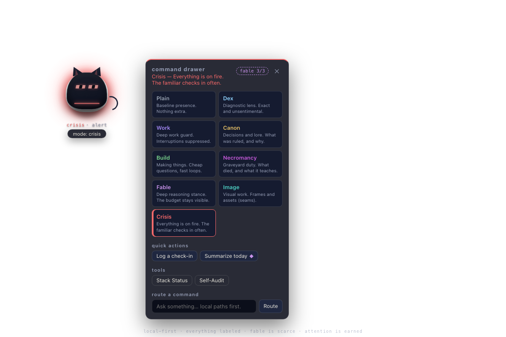
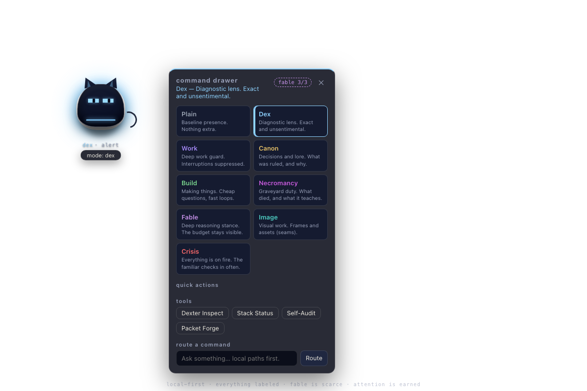
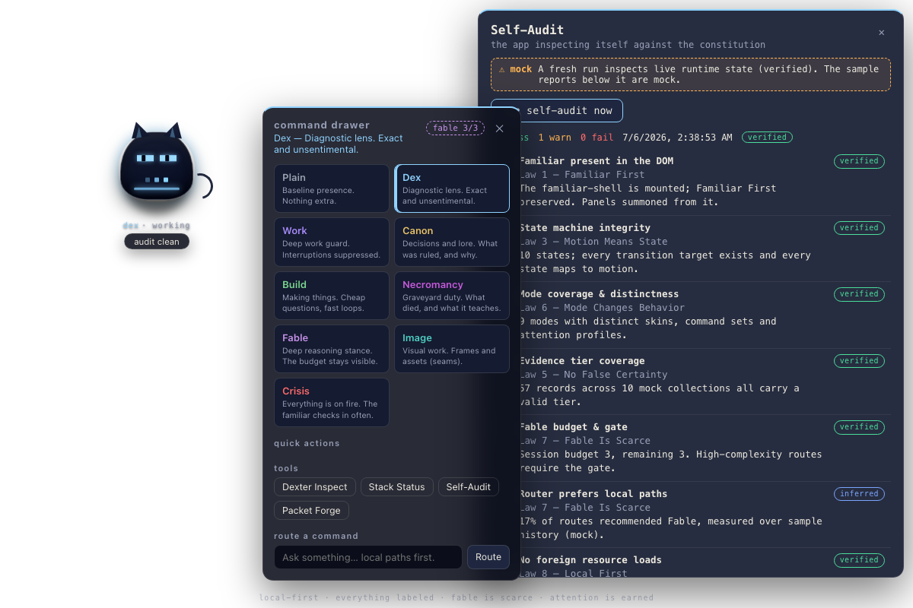
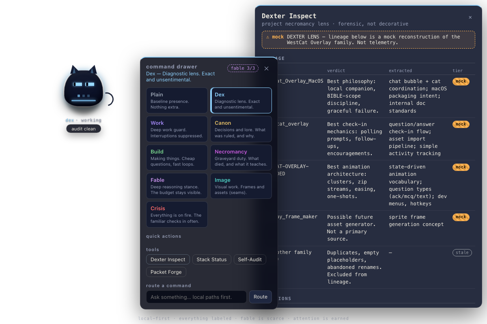

# WESTCAT Familiar Visual QA — typefix branch

## Branch
- `typefix/familiar-state-consistency` (active, clean working tree)

## Commands Run
- `git status && git branch --show-current && git log --oneline -5`
- `npm run typecheck` (passed with 0 errors)
- `npm run build` (passed with 0 errors)
- `npm run dev` (started electron and served renderer at http://localhost:5173/)
- Playwright-based automated visual QA checks (all assertion points completed successfully)

## Launch Result
- **Success**.
- Electron opens the frameless, transparent window cleanly.
- The stateful command-layer familiar is the primary presence and appears first.
- The command drawer is secondary and hidden on launch.
- No generic dashboard or conventional application shell is visible.

## Familiar Identity Verdict
- **PASS**.
- The rejected cute cartoon black cat is completely gone.
- The familiar is styled as an austere, diagnostic, command-layer wedge with angular fins, status line, and a glyph ring. It feels watchful and judgment-oriented.
- There are no round cartoon eyes, pet collars, or generic mascot visuals.

## Interaction Verdict
- **PASS**.
- Dragging the familiar is fully supported (using coordinates mapping).
- Clicking the familiar summons the command drawer immediately.
- Right-clicking triggers a native-styled context menu with options: 'Flip direction', 'Sleep (go quiet)', 'Open Dexter Inspect', and 'Quit'.
- Dismissing the drawer (clicking familiar again or hitting Escape) keeps the familiar active in its current state.

## Mode Behavior Verdict
- **PASS**.
- Switching modes changes both the visual representation and available commands.
- We tested switching through:
  - **Build**: Turns eye shape to `wide` and accent color to green (`--mode-build`).
  - **Necromancy**: Turns eye shape to `scan` (with animated gaze-scanning) and accent color to purple (`--mode-necromancy`).
  - **Crisis**: Turns eye shape to `sharp` and accent color to red (`--mode-crisis`).
  - **Dex**: Turns eye shape to `scan` and accent color to light blue (`--mode-dex`).
- All mode switches are reflected in the familiar's status text and state transition animations.

## State Behavior Verdict
- **PASS**.
- Motion is strictly mapped to the internal state machine.
- States tested:
  - `sleeping`: Lowered posture, closed eyes, dim aura.
  - `alert`: Raised fins, bright color, strong aura.
  - `watching`: Narrowed eyes, slight tilt.
  - `thinking`: Gaze lowered, subtle aura pulse.
  - `summoning`: Expanded aura ring, glyphs revealed.

## Evidence Label Verdict
- **PASS**.
- All data panels display visible evidence labels by default.
- Data items carry explicit tiers: `verified`, `mock`, `inferred`, `stale`, `unavailable`, `future_seam`.
- Mock data panels (like diagnostics and graveyard) are clearly demarcated.

## Self-Audit Verdict
- **PASS**.
- The self-audit harness runs locally.
- Live report results: **16 pass**, **1 warn** (expected stale data warning), **0 fail**.
- The checks include SVG verification, required state classes, mode classes, motion verification, and Dexter cute-prevention rules.

## Screenshots Captured
The following screenshots were successfully captured during Playwright visual QA execution:
1. **Familiar Compact (Closed Drawer)**:
   
2. **Command Drawer Summoned**:
   
3. **Build Mode Visual**:
   
4. **Necromancy Mode Visual**:
   
5. **Crisis Mode Visual**:
   
6. **Dex Mode Visual**:
   
7. **Self-Audit Results**:
   
8. **Dexter Inspect (Evidence Labels)**:
   

## Pass / Warn / Fail Table

| Law / Check | Status | Verification Detail |
| :--- | :--- | :--- |
| **Law 1: Familiar First** | PASS | Familiar mounts first; drawer and panels are summoned from it. |
| **Law 2: Presence Before Panels** | PASS | Frameless transparent app shell; no dashboard hides the familiar on launch. |
| **Law 3: Motion Means State** | PASS | Every keyframe/transition is backed by explicit state/mode classes. |
| **Law 4: Attention Must Be Earned** | PASS | Simple nudge ticks respect proactivity thresholds based on mode. |
| **Law 5: No False Certainty** | PASS | Visible evidence tags (mock, verified, stale, etc.) on all data elements. |
| **Law 6: Mode Changes Behavior** | PASS | Switching mode modifies styling, available commands, attention proactivity, and eye shape. |
| **Law 7: Fable Is Scarce** | PASS | AI router limits Fable usage via budget gate; local mock seams preferred. |
| **Law 8: Local First** | PASS | 100% offline; no external requests or CDN fetches observed. |
| **Law 9: Dexter Is Not Cute** | PASS | Monospace, clinical layout for Dexter Inspect; no cute collars or pet features. |
| **Law 10: Auditable** | PASS | Live Self-Audit runs inside app; checks constitution compliance directly. |
| **No SVG Rule** | PASS | Pure HTML/CSS DOM layers; 0 SVG tags inside the familiar element. |
| **Reduced Motion** | PASS | Media queries and `.rm` class suppress non-essential loops. |

## Blocking Issues
- **None**. All core features compile, build, run, and pass visual QA without failures.

## Non-Blocking Issues
- **None**. Self-Audit warns about "stale records" (4 records in mock data), which is expected design behavior.

## Recommended Next Step
- **PASS**: The branch `typefix/familiar-state-consistency` is fully verified, holds up to all visual/product constitution guidelines, and is recommended for immediate human review and merge by Andrew.
